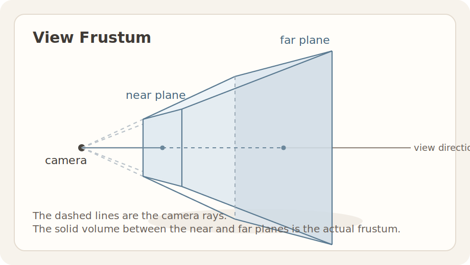
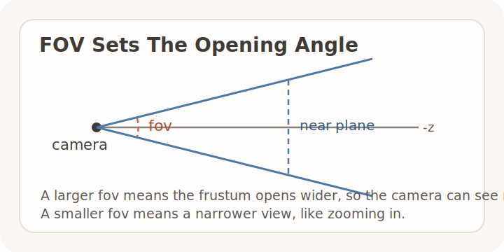

在前面的两篇文章中，我们从画线开始，一路实现了三角形光栅化，并利用 Z-Buffer 解决了复杂图元的遮挡问题。

但是，光栅化器无法直接输入三维坐标，这就是为什么我们需要引入**坐标变换（Coordinate Transformations）**。

很多教程习惯一上来就铺开三维矩阵，但在亲手写完最底层的光栅化器之后，再回头看坐标变换，逻辑其实会清楚得多：

1. **从 3D 到 2D 的投影变换**：模型数据是全方位的三维坐标，而光栅化器只认二维屏幕上的像素点。要把立体的 3D 模型“拍扁”投射到 2D 屏幕上，还想产生近大远小的效果，显然需要一套数学变换。
2. **相机的视角变换**：要在场景中游历，我们需要一台能自由走动、转动视角的“相机”，让画面跟随相机位置实时变化，这显然需要另一套控制视角的数学变换。

正是为了解决降维投射与相机移动这两个问题，图形学引入了 **MVP 矩阵（Model, View, Projection）** 与视口映射（Viewport Transform）。这一篇就结合 TinyRenderer 的代码，把三维模型如何一步步走到二维像素，完整串起来。

---

### 0. 术语与基石：整体流水线与坐标系

在逐一拆解代码之前，我们先从整体上看一下这条坐标变换流水线。

不管中间的数学魔法有多复杂，我们的最终目的只有一个：把模型上的一个 **3D 顶点坐标** $p_{local}$，一步步送到最终的**屏幕像素坐标** $p_{screen}$。更准确地说，这里有一条按空间顺序展开的变换链：

$$
p_{world}=Mp_{local},\qquad
p_{view}=Vp_{world},\qquad
p_{clip}=Pp_{view}=
\begin{bmatrix}
x_{clip}\\
y_{clip}\\
z_{clip}\\
w_{clip}
\end{bmatrix}
$$

$$
p_{ndc}=
\begin{bmatrix}
x_{clip}/w_{clip}\\
y_{clip}/w_{clip}\\
z_{clip}/w_{clip}
\end{bmatrix},
\qquad
p_{screen}=Viewport(p_{ndc})
$$

对应的 6 个坐标空间可以顺着这条链来读：

- **局部空间（Local Space）**：输入顶点就是 $p_{local}$。
- **世界空间（World Space）**：模型经过模型矩阵 $M$ 后得到 $p_{world} = M p_{local}$。
- **观察空间（View / Camera Space）**：世界再经过视图矩阵 $V$ 后得到 $p_{view} = V p_{world}$。
- **裁剪空间（Clip Space）**：顶点经过 $P$ 变换后的中间结果是 $p_{clip} = P p_{view}$。
- **NDC（Normalized Device Coordinates）**：对裁剪空间坐标做完透视除法后得到 $p_{ndc}$，也就是把 $(x_{clip}, y_{clip}, z_{clip}, w_{clip})$ 归一化为 $(x_{clip}/w_{clip}, y_{clip}/w_{clip}, z_{clip}/w_{clip})$。
- **屏幕空间（Screen Space）**：最后经过视口映射得到 $p_{screen} = Viewport(p_{ndc})$。

也就是说，前 3 步是矩阵乘法，后 2 步分别是透视除法和视口映射；而“坐标空间”这个概念，本质上就是在给这条变换链上的每一个中间结果命名。

对应的伪代码（或渲染器的主循环逻辑）看起来就是这样直白：
```cpp
// 1. 获取各个阶段的变换矩阵
Matrix4f model = GetModelMatrix(model_pos, model_rot);
Matrix4f view = GetViewMatrix(camera_pos, camera_rot);
Matrix4f proj = GetProjectionMatrix(fov, aspect_ratio, zNear, zFar);

// 2. 对每个顶点执行变换：从局部空间 -> 世界空间 -> 观察空间 -> 裁剪空间
Vec4f clip_coord = proj * view * model * p_local;

// 3. 透视除法（归一化到 NDC）并进行 Viewport 视口映射
Vec3f p_screen = ViewportTransform(clip_coord / clip_coord.w);
```

**关于左右手坐标系的约定**：
打开 TinyRenderer 的源码文件 `main_ogl.cpp`，你能看到我用注释专门画了项目依赖的坐标系：
```text
///      y
///      ^
///      |
///      ----------------> x
///             2D (Screen)
/// 
///           y
///           ^
///           |
///           ------------> x
///          /
///         / 
///        v
///       z
///              3D (World/Camera)
```
可以看到，在 3D 空间中：**X 轴向右，Y 轴向上，Z 轴向外（指向屏幕外的观察者）**。这是一个典型的**右手坐标系（Right-Handed System）**。这意味着相机默认是顺着 **-Z 轴** 的方向“看”进屏幕深处的。

为了让矩阵能搞定包括平移在内的所有基础变换，我们还需要引入**齐次坐标（Homogeneous Coordinates）与 $4 \times 4$ 矩阵**：由于 $3 \times 3$ 矩阵只能旋转缩放，我们为坐标加上第四个分量 $w$。点表示为 $(x,y,z,1)$，向量为 $(x,y,z,0)$。这一步不仅将平移纳入了矩阵乘法，更是在后面实现“透视除法”（除以 $w$ 实现近大远小）的关键。

有了全局的公式流水线和坐标系概念，接下来我们深入具体的代码，将这四步拆解开来。

---

### 1. 拆解一：模型变换与视图变换 (Model & View)

第一步是**模型变换（Model Transform）**。它负责把模型从自身的局部空间搬到统一的世界空间（World Space）。在代码实现中，这涉及到模型的**平移（Translation）与旋转（Rotation）**。

在 TinyRenderer 中，`GetModelMatrix` 标准地实现了这一过程（注意执行的顺序为先旋转，最后平移，对应矩阵乘法 $T \times R$。如果顺序乱了，比如先平移再旋转，物体就不会是原地自转，而是像卫星一样绕着世界原点公转了）：

```cpp
math::Matrix4f TinyRender::GetModelMatrix(math::Vec3f translation, math::Vec3f rotation)
{
    math::Matrix4f translationMatrix(...); // 平移矩阵 T
    // 矩阵乘数从右向左作用于顶点：(T * (R * v))
    return translationMatrix * GetRotationMatrix(rotation.x, rotation.y, rotation.z);
}
```

第二步是**视图变换（View Transform / Camera Transform）**。它的核心思想可以概括成一句话：与其真的去“移动相机”，不如把相机固定在原点 $(0,0,0)$，并让它永远朝向 $-Z$ 方向，再把整个世界反向变换到相机面前。

既然相机在世界空间中的位姿是由平移 $T_{cam}$ 和 旋转 $R_{cam}$ 决定的（即 $T_{cam} \times R_{cam}$），那么我们要把全世界“反向”拉回相机的视角，对应的逆矩阵就是 $(T_{cam} \times R_{cam})^{-1} = R_{cam}^{-1} \times T_{cam}^{-1}$。

这正是 `GetViewMatrix` 代码所做的事情：

**第一步**：算出反向的平移矩阵 $T_{cam}^{-1}$（直接将相机的坐标取反）：
```cpp
math::Matrix4f translation(
    1, 0, 0, -cameraPos.x,
    0, 1, 0, -cameraPos.y,
    0, 0, 1, -cameraPos.z,
    0, 0, 0, 1
);
```

**第二步**：算出反向的旋转矩阵 $R_{cam}^{-1}$（将相机的欧拉角取反），并将它们按 $R_{cam}^{-1} \times T_{cam}^{-1}$ 的顺序相乘：
```cpp
math::Matrix4f TinyRender::GetViewMatrix(math::Vec3f cameraPos, math::Vec3f cameraRot)
{
    // ...构建上面的平移矩阵翻译...
    return GetRotationMatrix(-cameraRot.x, -cameraRot.y, -cameraRot.z) * translation;
}
```

而在主循环中，它们是如此直白地被串联在一起的：
```cpp
auto modelMatrix = GetModelMatrix(modelTransform.pos, modelTransform.rot);
auto viewMatrix = GetViewMatrix(viewPos, viewRot);
// 顶点最终变换： proj * view * model * p_local
```

经过这一步，模型顶点已经站在了相机的正前方，整装待发，等待投影的压缩。

---

### 2. 拆解二：投影变换和透视除法 (Projection Transform & Perspective Divide)

我们已经得到了经过 $M$ 和 $V$ 变换后的顶点。先暂时把“矩阵怎么写”放一边，先回答两个更基础的问题：**相机到底看到了哪一块三维空间？这块空间最后又会被映射到哪里？**

#### 2.1 视锥体与 NDC

答案是：相机可见的那块三维空间叫作**视锥（view frustum）**。而投影阶段的目标，则是把它进一步映射到 **NDC 空间**。



这个视锥体由 4 个参数共同定义：

- `fov`：视场角（field of view），决定镜头张开的角度。
- `aspect_ratio`：视口宽高比，通常是 `width / height`，决定横向和纵向的比例关系。
- `zNear`：近平面距离，表示离相机最近、仍然会被保留的深度范围起点。
- `zFar`：远平面距离，表示离相机最远、仍然会被保留的深度范围终点。

可以把它们理解成两组控制量：

- `fov` 与 `aspect_ratio` 决定视锥体“开多大、长什么比例”；
- `zNear` 与 `zFar` 决定视锥体“从哪里开始、到哪里结束”。

先看 `fov`。它控制的是视锥体的张角：



`fov` 越大，镜头开得越广，能看到的范围越大；`fov` 越小，镜头越窄，画面更像“拉近”了一样。

再看 `aspect_ratio`。它控制的是近平面在 `x/y` 方向上的宽高比例：

如果视口更宽，`aspect_ratio = width / height` 就更大，视锥体在水平方向也要相应张得更开；否则画面会被横向压扁或拉伸。

到这里，其实已经可以把视锥体的几何边界写出来了。设

$$
n=zNear,\qquad f=zFar
$$

那么在**近平面**上，视锥体的上、下、左、右边界通常记为 `t, b, l, r`。根据 `fov` 和 `aspect_ratio`，它们可以直接算出：

$$
t=n\tan\left(\frac{fov}{2}\right),\qquad b=-t
$$

$$
r=aspect\_ratio\cdot t,\qquad l=-r
$$

也就是说：

- `fov` 决定的是上下边界 `t / b` 离中心轴有多远；
- `aspect_ratio` 决定的是左右边界 `l / r` 相对上下边界要再放大多少；
- `zNear` 决定这些边界是量在多远的那个截面上；
- `zFar` 决定视锥体沿深度方向延伸到哪里结束。

所以，`fov`、`aspect_ratio`、`zNear`、`zFar` 的真正作用，并不是“直接控制屏幕像素”，而是**先把 view frustum 的几何边界定出来**。

接下来，投影阶段要做的事情就是把这个视锥体映射到 **NDC（Normalized Device Coordinates，规范化设备坐标）**。在这个标准空间里，可见点会被统一压到固定范围：

$$
x_{ndc}, y_{ndc}, z_{ndc} \in [-1, 1]
$$

这样一来，不管原来的相机参数和可见体积形状如何不同，后续阶段面对的都可以是同一个标准化坐标范围。也正因为如此，投影矩阵并不是直接把顶点送到屏幕像素，而是先把**在当前相机空间约定下**由 `l, r, b, t, n, f` 描述的标准视锥体，规范地映射到 NDC 的标准空间里。

#### 2.2 透视投影

透视投影对应的是我们最熟悉的相机效果：**近处看起来更大，远处看起来更小**。这意味着顶点的投影结果不能只由 `x` 和 `y` 决定，还必须和它离相机有多远有关。

从几何上看，透视投影处理的正是前面定义出来的这个**视锥体**。它最后会把视锥体映射到 NDC，但这个过程不能一步直接完成，而是要先到裁剪空间，再做一次透视除法。

透视投影的投影阶段要完成三件事：

1. 让 $x,y$ 随深度增大而缩小，也就是产生近大远小；
2. 把深度限制在近平面 $n$ 和远平面 $f$ 之间；
3. 把结果送进规范化设备坐标，也就是 NDC。

#### 2.2.1 裁剪空间与透视除法

把相机空间中的一个点直接记为

$$
p_{view}=
\begin{bmatrix}
x\\
y\\
z\\
1
\end{bmatrix}
$$

图形管线并不是直接从 view space 一步跳到 NDC，而是先做一次矩阵乘法得到**裁剪空间坐标**：

$$
p_{clip}=Pp_{view}=
\begin{bmatrix}
x_{clip}\\
y_{clip}\\
z_{clip}\\
w_{clip}
\end{bmatrix}
$$

然后再统一做一次**透视除法**：

$$
p_{ndc}=
\begin{bmatrix}
x_{clip}/w_{clip}\\
y_{clip}/w_{clip}\\
z_{clip}/w_{clip}
\end{bmatrix}
$$

这里的裁剪空间并不是多绕了一步，而是投影过程里必须保留的一层中间表示。很多初学者都会有疑问：**既然最后都要除，为什么不在顶点变换时一步到位，直接跳到 2D 坐标呢？**

原因主要有三点：

1. **矩阵乘法本身不负责除法**：投影矩阵能做的是先生成 $p_{clip}$，而真正的 $\frac{x}{w},\frac{y}{w},\frac{z}{w}$ 要在后面的透视除法阶段统一完成。
2. **裁剪必须发生在透视除法之前**：如果一个图元跨过近平面，直接除以深度会让坐标发散甚至翻转。保留裁剪空间坐标，才能先按 $-w_{clip}\le x_{clip},y_{clip},z_{clip}\le w_{clip}$ 做可见性判断和裁剪。
3. **后续插值还要继续使用 $w$**：透视校正插值依赖的正是这一步保留下来的 $w_{clip}$。如果过早把它丢掉，纹理坐标、深度和其他顶点属性在三角形内部的插值都会失真。

所以，投影矩阵 $P$ 真正要做的事情不是“直接吐出最终屏幕坐标”，而是：**先构造出既适合裁剪、也适合透视除法的裁剪空间坐标。**
下面进行投影矩阵 $P$ 的推导。

#### 2.2.2 投影矩阵推导

现在开始真正推导透视投影矩阵。思路其实很直接：**先写出一个满足透视除法要求的矩阵形状，再用近平面和远平面的边界条件把里面的未知数解出来。**

设相机空间中的点写成

$$
p_{view}=
\begin{bmatrix}
x\\
y\\
z\\
1
\end{bmatrix}
$$

并记 `zNear = n > 0`、`zFar = f > 0`。在 TinyRenderer 这套约定里，相机朝着 $-Z$ 方向看，所以近平面和远平面在相机空间中的实际深度分别是

$$
z=-n,\qquad z=-f
$$

透视投影的关键，是让透视除法时的分母正好和深度对应起来。于是我们先假设投影矩阵长成下面这个形状：

$$
P=
\begin{bmatrix}
a & 0 & 0 & 0\\
0 & b & 0 & 0\\
0 & 0 & c & e\\
0 & 0 & -1 & 0
\end{bmatrix}
$$

这个形状并不是拍脑袋写出来的，而是按目标一点点收出来的：

- 第一行和第二行只负责处理横向、纵向缩放，所以分别保留两个未知数 $a,b$。
- 第三行负责深度映射。透视除法之后，我们希望深度既有常数项，又有和 $\frac{1}{z}$ 相关的项，所以这里保留两个自由度 $c,e$。如果 $e=0$，那么除法后 $z_{ndc}$ 会退化成常数，近平面和远平面就无法映射到不同深度。
- 第四行的目标最明确，但也极其关键：我们希望
  $$
  w_{clip}=-z
  $$
  这样透视除法时的分母就会对应前向深度。在右手坐标系里，位于相机前方的点满足 $z<0$，所以这里写成 $-1$，本质上是把可见点的深度转换成一个正的分母。

把这个矩阵乘到点 $p_{view}$ 上：

$$
p_{clip}=Pp_{view}=
\begin{bmatrix}
ax\\
by\\
cz+e\\
-z
\end{bmatrix}
$$

再做透视除法：

$$
p_{ndc}=
\begin{bmatrix}
\frac{ax}{-z}\\
\frac{by}{-z}\\
\frac{cz+e}{-z}
\end{bmatrix}
=
\begin{bmatrix}
\frac{ax}{-z}\\
\frac{by}{-z}\\
-c-\frac{e}{z}
\end{bmatrix}
$$

到这里，问题就被压缩成了一个非常清楚的形式：只要解出 $a,b,c,e$，整个投影矩阵就确定了。

先解前两行。根据前面视锥体的定义，在近平面上有

$$
t=n\tan\left(\frac{fov}{2}\right),\qquad
r=aspect\_ratio\cdot t
$$

而透视除法后有

$$
x_{ndc}=\frac{ax}{-z},\qquad y_{ndc}=\frac{by}{-z}
$$

在近平面的右边界和上边界上，应满足

$$
z=-n,\ x=r \Rightarrow x_{ndc}=1
$$

$$
z=-n,\ y=t \Rightarrow y_{ndc}=1
$$

代入就得到

$$
1=\frac{ar}{n}\Rightarrow a=\frac{n}{r}
$$

$$
1=\frac{bt}{n}\Rightarrow b=\frac{n}{t}
$$

再把 $r,t$ 展开：

$$
a=\frac{1}{aspect\_ratio\cdot \tan(fov/2)},\qquad
b=\frac{1}{\tan(fov/2)}
$$

接着解第三行。由上面的形式，透视除法后深度写成

$$
z_{ndc}=-c-\frac{e}{z}
$$

在 TinyRenderer 这套约定里，对应 OpenGL 风格的 NDC 深度映射：

- 当点落在近平面时，$z=-n$，希望它映射到 $z_{ndc}=-1$；
- 当点落在远平面时，$z=-f$，希望它映射到 $z_{ndc}=1$。

于是得到方程组：

$$
\begin{cases}
-c+\frac{e}{n}=-1\\
-c+\frac{e}{f}=1
\end{cases}
$$

两式相减可得

$$
e\left(\frac{1}{n}-\frac{1}{f}\right)=-2
\Rightarrow
e=-\frac{2nf}{f-n}
$$

再代回去：

$$
c=1+\frac{e}{f}
=1-\frac{2n}{f-n}
=-\frac{f+n}{f-n}
$$

于是投影矩阵就完整确定了：

$$
P=
\begin{bmatrix}
\frac{1}{aspect\_ratio\cdot \tan(fov/2)} & 0 & 0 & 0\\
0 & \frac{1}{\tan(fov/2)} & 0 & 0\\
0 & 0 & -\frac{f+n}{f-n} & -\frac{2fn}{f-n}\\
0 & 0 & -1 & 0
\end{bmatrix}
$$

这和 TinyRenderer 源码返回的矩阵逐项一致：

```cpp
return math::Matrix4f(
    1.f / (aspect_ratio * tanHalfFov), 0, 0, 0,
    0, 1.f / tanHalfFov, 0, 0,
    0, 0, -(zFar + zNear) / (zFar - zNear), -(2.f * zFar * zNear) / (zFar - zNear),
    0, 0, -1.f, 0);
```

所以，所谓透视投影矩阵，本质上并不是在“凭空制造透视感”，而是把“近大远小 + 深度映射”压缩成了一次矩阵乘法，再配上一句统一的 `divide by w`。

#### 2.2.3 现代 GPU 管线里的透视投影和透视除法

把前面的数学推导放回现代 GPU 管线里看，这套“两步走”的设计其实并不只是数学上写起来方便，它也非常贴合 GPU 的硬件组织方式。原因在于：矩阵乘法、裁剪、除法和插值，本来就是由不同的硬件阶段负责的。

一个顶点通常会按下面的顺序流过硬件流水线：

1. **顶点着色器阶段（Vertex Shader）**  
   顶点先经过模型、观察和投影矩阵的作用，输出齐次裁剪坐标
   $$
   p_{clip}=[x_{clip},y_{clip},z_{clip},w_{clip}]^T
   $$
   在 OpenGL 里，这一步对应的就是写入 `gl_Position`。从硬件角度看，这一阶段最擅长的正是矩阵乘法这样的乘加运算：同一套指令可以被成千上万个顶点并行执行，吞吐很高，也容易向量化。

2. **图元装配与裁剪阶段（Primitive Assembly & Clipping）**  
   GPU 会先在裁剪空间里检查图元是否落在可见范围内，也就是利用
   $$
   -w_{clip}\le x_{clip},y_{clip},z_{clip}\le w_{clip}
   $$
   这组条件做裁剪。这里之所以一定要保留 `clip space`，一个直接的硬件原因就是：裁剪器需要看到完整的齐次坐标，才能稳定地判断图元和六个裁剪面的关系。之所以不能先做透视除法再处理，原因就在这里：跨越近平面的图元在除法前后会出现完全不同的数值行为，必须先裁掉越界部分。

3. **透视除法阶段（Perspective Divide）**  
   裁剪之后，GPU 再统一计算
   $$
   x_{ndc}=\frac{x_{clip}}{w_{clip}},\qquad
   y_{ndc}=\frac{y_{clip}}{w_{clip}},\qquad
   z_{ndc}=\frac{z_{clip}}{w_{clip}}
   $$
   这一步之后，坐标才真正进入 NDC。近大远小的效果也是在这里体现出来的。把这一步单独拿出来，还有一个硬件层面的好处：除法通常比普通乘加更昂贵、延迟也更高，集中在统一阶段处理，比把它混进每次顶点变换里更容易控制流水线。

4. **光栅化与透视校正插值（Rasterization & Perspective-Correct Interpolation）**  
   即使位置已经进入 NDC，GPU 也不会立刻丢掉 $w$。在三角形内部插值纹理坐标、深度和其他顶点属性时，仍然需要利用和 $w$ 相关的信息做透视校正插值，否则结果会出现明显失真。从硬件实现上说，这意味着 `w` 不只是投影阶段的临时变量，它还是光栅化和插值单元后续要继续消费的数据。

从这个角度看，透视投影之所以拆成“先得到 $p_{clip}$，再做透视除法”两步，并不只是数学推导上的方便写法，也是现代 GPU 在不同硬件单元之间分配职责后的自然结果：

- 顶点单元擅长并行乘加，所以负责矩阵变换；
- 裁剪单元需要齐次坐标，所以消费 `clip space`；
- 透视除法单元统一完成非线性的除法；
- 光栅化与插值单元继续利用 `w` 做透视校正。

也正因为这几个阶段彼此衔接，`clip space -> perspective divide -> NDC` 才会成为现代图形管线里的标准接口。

#### 2.3 正交投影

和透视投影相对，正交投影不会产生近大远小。它更像是把一个长方体可见区域直接压到屏幕上：物体离相机更近还是更远，投影后的大小都不变，平行线也会继续保持平行。

从几何上看，正交投影处理的不是视锥体，而是一个盒子。它本质上是线性缩放和平移，所以不需要额外的透视除法。

TinyRenderer 里也保留了这一条分支：

```cpp
if (m_config.proj == Config::orthogonal)
{
    float orthoHalfHeight = 4.f;
    float orthoHalfWidth = orthoHalfHeight * aspect_ratio;
    float l = -orthoHalfWidth;
    float r = orthoHalfWidth;
    float b = -orthoHalfHeight;
    float t = orthoHalfHeight;
    return math::Matrix4f(
        2.f / (r - l), 0, 0, -(r + l) / (r - l),
        0, 2.f / (t - b), 0, -(t + b) / (t - b),
        0, 0, -2.f / (zFar - zNear), -(zFar + zNear) / (zFar - zNear),
        0, 0, 0, 1);
}
```

可以看到，正交投影矩阵的第四行是 `[0,0,0,1]`，也就是 `w` 保持为 1，不再承担“提供分母”的职责。这正是它和透视投影最本质的区别。

---

### 3. 拆解三：视口映射 (Viewport Transform)

经过 Model、View、Projection 以及透视除法之后，顶点才真正进入了 $[-1, 1]$ 的 NDC 空间。接下来就是这条数学流水线的最后一步：把它交给光栅化器。

将 NDC 的 $[-1, 1]$ 区间线性映射到屏幕像素空间的公式很直接：

$$x_{screen} = (x_{ndc} + 1) \times \frac{width}{2}, \quad y_{screen} = (y_{ndc} + 1) \times \frac{height}{2}$$

等价于先把 $[-1, 1]$ 平移到 $[0, 2]$，再缩放到 $[0, width]$。$z$ 坐标保留，继续用于 Z-Buffer 深度测试。代码以内联方式完成这一步，不构造矩阵：

```cpp
// viewport transform（内联完成）
p0 = math::Point3f((v0.x + 1.f) * width / 2.f,  (v0.y + 1.f) * height / 2.f, v0.z);
p1 = math::Point3f((v1.x + 1.f) * width / 2.f,  (v1.y + 1.f) * height / 2.f, v1.z);
p2 = math::Point3f((v2.x + 1.f) * width / 2.f,  (v2.y + 1.f) * height / 2.f, v2.z);
```

---

### 总结：管线闭环

回头看这篇文章，真正需要串起来的其实有两条线：

- 一条是**坐标空间的变化链**：顶点从 $p_{local}$ 出发，依次经过 $p_{world}$、$p_{view}$、$p_{clip}$、$p_{ndc}$，最后到达 $p_{screen}$。
- 另一条是**投影阶段内部的两步走**：先用投影矩阵把视锥体送到裁剪空间，再通过透视除法把它压到统一的 NDC 立方体里。

把这两条线放在一起看，整个 MVP 矩阵与视口映射管线就闭合了：

1. **Model（$M$ 矩阵）**：把局部模型放进统一的三维世界（World Space）。
2. **View（$V$ 矩阵）**：将世界坐标以相机为原点进行排齐，并看向指定的 $-Z$ 轴（Camera/View Space）。
3. **Projection（$P$ 矩阵）**：先把顶点从 view space 送到 clip space，并通过第四行构造出 $w=-z$；随后经透视除法产生近大远小，同时把深度映射到 NDC 的 $[-1, 1]$ 区间。
4. **Viewport（视口映射）**：最后一步把规范空间线性映射到具体的屏幕像素范围（例如 $[0, 800] \times [0, 600]$），得到最终的屏幕空间坐标。

其中最容易被忽略、但也是投影最关键的一步，就是 **clip space 不是终点，NDC 也不是矩阵直接乘出来的**。投影矩阵负责准备好适合裁剪和透视除法的齐次坐标，真正把“近大远小”显现出来的是后面的 `divide by w`。这也是为什么现代 GPU 管线会把投影拆成“矩阵变换”和“透视除法”两个阶段。

此时，输出的 $p_{screen}$ 终于变成了诸如 $(402, 350, 100)$ 这样可以直接交给光栅化器处理的具体数字。把这些带着深度信息的三角形顶点传给我们在第二篇里实现的 `DrawTriangle` 函数后，前面铺好的光栅化、重心坐标、插值与深度测试这些基础设施，就能真正开始工作，把一个 3D 模型稳定地绘制到屏幕上。

**从 3D 顶点到 2D 像素，现代渲染管线中最核心的一段坐标变换闭环，到这里就正式打通了。**
